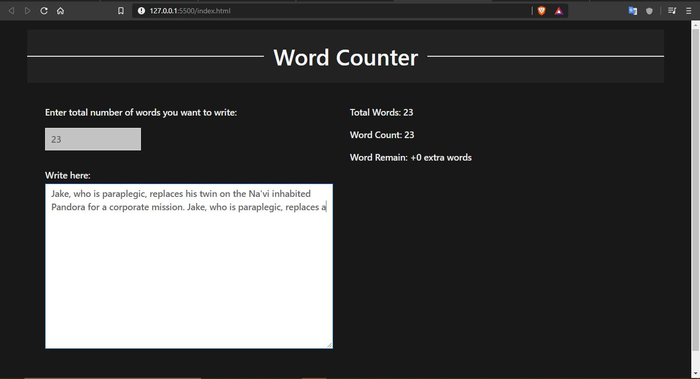
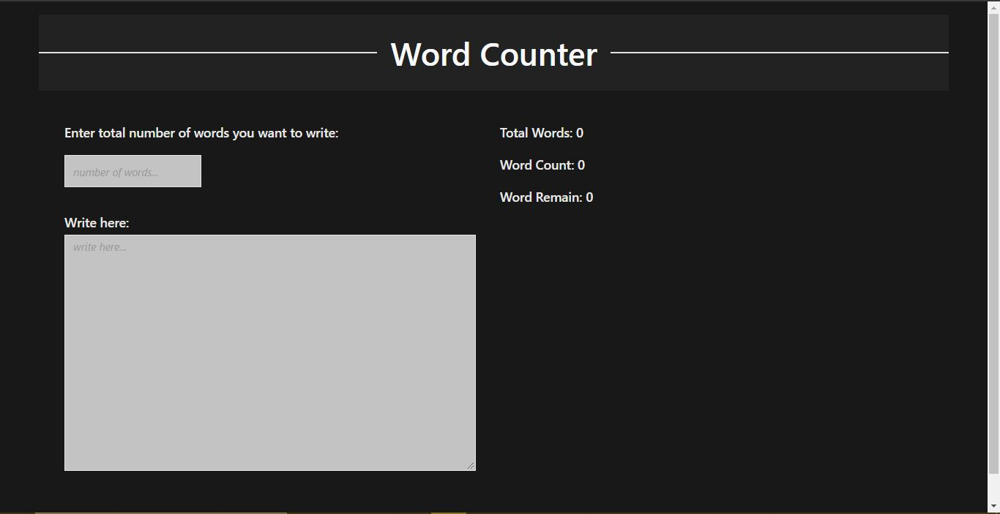
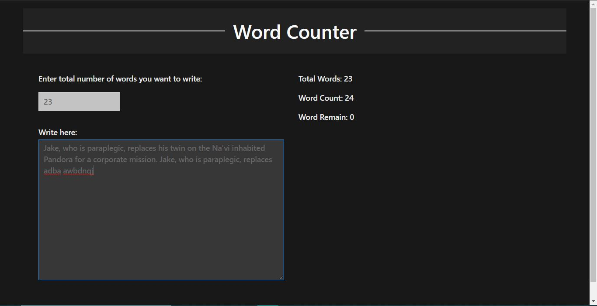

# Word-counter
<ol>
    <li>
        <h3>About</h3>
    </li>
    

        A word counter using pure Javascript and for designing UIkit and Bootstrap is used.
    

    <li>
        <h3>UI</h3>
    </li>
    

        
        
        
    

</ol>